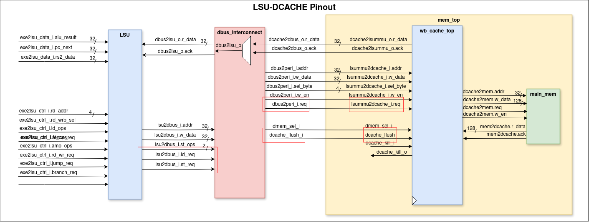
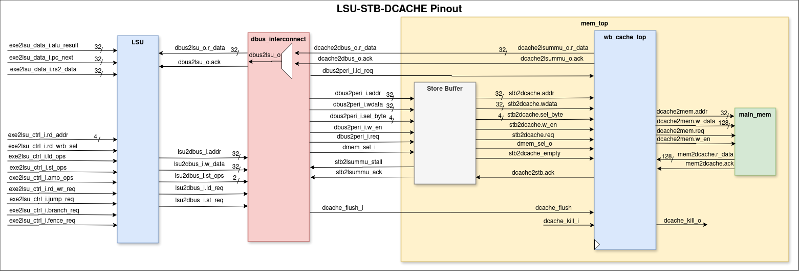
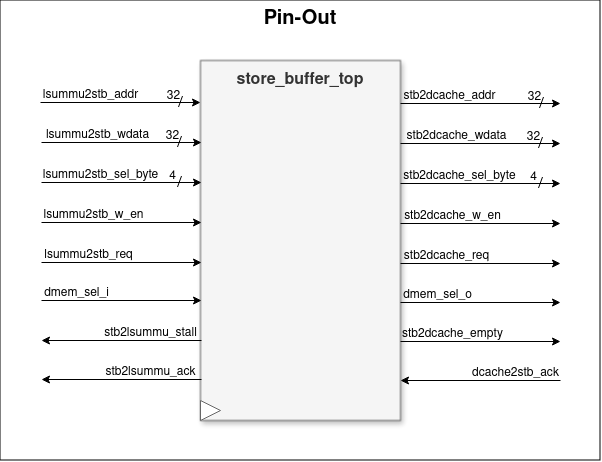
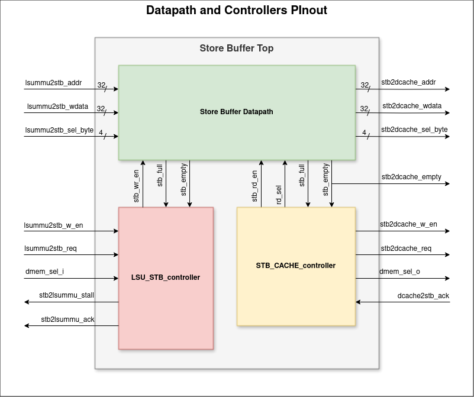
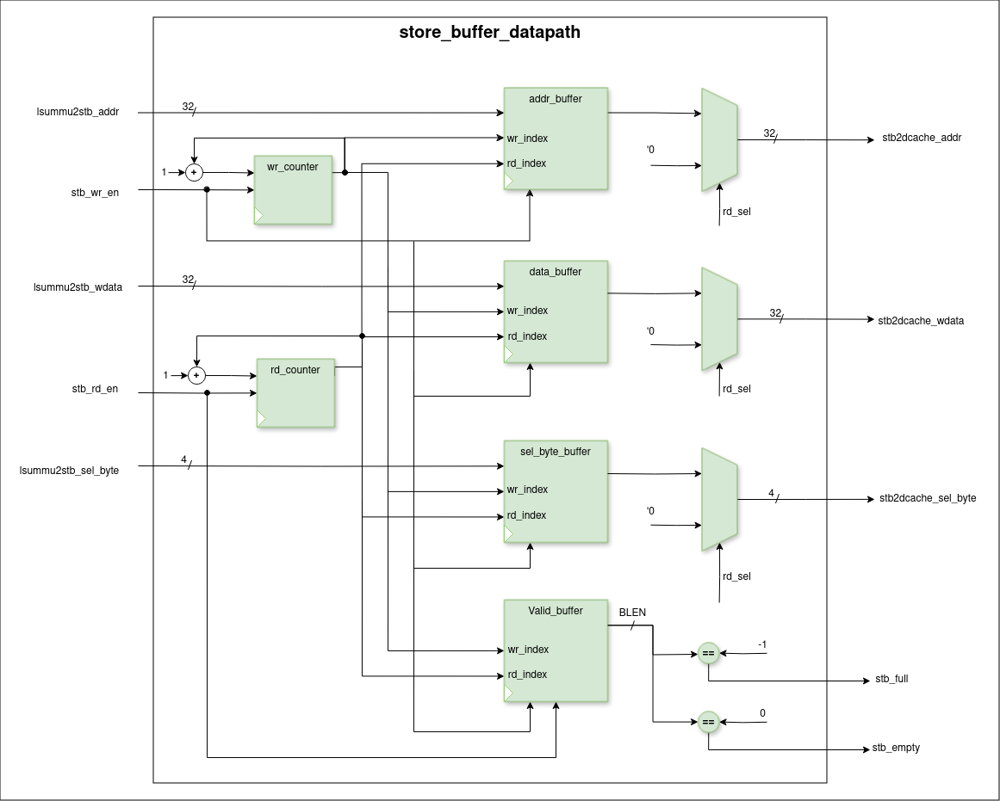

# Store Buffer in UETRV_Pcore

## Overview
A **store buffer** is a temporary holding area for data that is being written to memory. Its key function is to improve system performance by allowing the CPU to continue executing instructions while memory write operations complete in the background.

In **UETRV_Pcore**, we are implementing a store buffer between the Load/Store Unit (LSU) and the data cache (dcache). This enhancement decouples memory write operations from instruction execution, effectively reducing CPU stalls caused by waiting for memory writes, thus boosting overall performance.

## Benefits of the Store Buffer

- **Improved Instruction Execution**: Store buffers enable the CPU to execute instructions independently of slow memory write processes. The data is temporarily held in the buffer while the CPU processes subsequent instructions, reducing execution delays.
  
- **Reduced Memory Latency**: Factors like bus contention or slow memory access times can cause delays in memory writes. The store buffer mitigates these delays by handling writes asynchronously, allowing the CPU to stay productive.
  
- **Efficient Memory Operations**: When the store buffer has available space, store instructions write to it immediately. The buffer then handles the memory writes in the background, improving efficiency in high-traffic scenarios.

## Operation Flow

When a store instruction is executed:
1. The data is first written to the store buffer.
2. The CPU immediately continues executing subsequent instructions without waiting for the store to complete.
3. The store buffer then writes data to memory when possible, ensuring that store operations are handled efficiently without stalling the CPU.

## Pinout Diagrams

### LSU to Dcache (Without Store Buffer)



### LSU to Store Buffer to Dcache (With Store Buffer)



## Store Buffer Diagram

The datapath and the controller of the store buffer design is in the below diagrams:

### Top Level Diagram



### Datapath and Controller



### Datapath



### Controllers

#### LSU-STB-Controller


#### STB-CACHE-Controller


## How to Run the Store Buffer Project

### Prerequisites
- Ensure Vivado, ModelSim (for VSIM), or Icarus Verilog (for iverilog) are installed and added to your PATH.

### Running Simulation in Vivado
To simulate the store buffer project using Vivado, you can use the following make commands:

1. **Compile and Elaborate:**
   ```
   make viv_compile
   make viv_elaborate
   ```
2. **Run Simulation:**
   ```
   make vivado
   ```
3. **Open Waves:**
   ```
   make viv_waves
   ```
### Running Simulation in Modelsim
To simulate the store buffer project using Modelsim, you can use the following make commands:

1. **Compile the source files:**
   ```
   make vsim_compile
   ```
2. **Run Simulation:**
   ```
   make simulate
   ```
### Running Simulation in Iverilog
To simulate the store buffer project using iverilog, you can use the following make commands:

1. **Compile the Project:**
   ```
   make iverilog
   ```
2. **Run Simulation:**
   ```
   make vvp
   ```
3. **Open Waves through GTKWAVE:**
   ```
   make view_wave
   ```

### Clean Up
To remove all generated files and reset the environment, use:
   ```
   make clean
   ```
   
